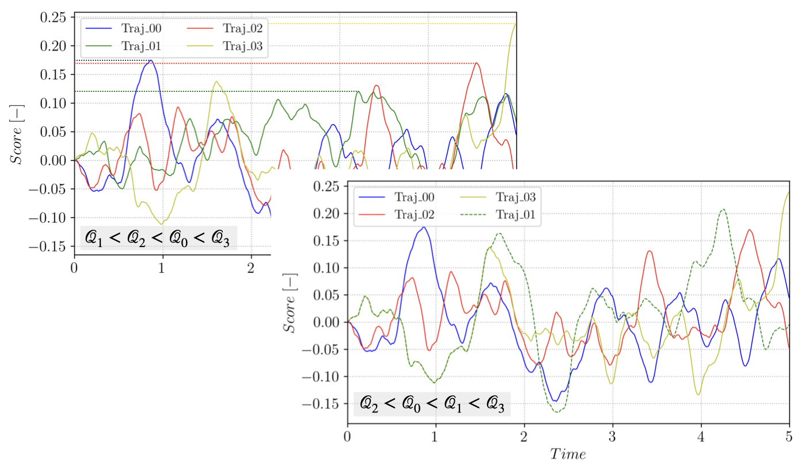

.. highlight:: rst

.. _sec:tams:

Theory
======

Stochastic dynamical systems
----------------------------

Stochastic dynamical systems describe the evolution of a random process :math:`(X_t)_{t \ge 0}`,
where the state :math:`X_t \in \mathbb{R}^{d}` evolves according to probabilistic rules
rather than deterministic dynamics only. If the system is Markovian, i.e.
:math:`X_{t+\Delta t}` depends only on the current state :math:`X_t`, its behavior can be
characterized by a stochastic differential equation (SDE) of the form:

.. math::

   dX_t = f(X_t)\,dt + g(X_t)\,dW_t.

where :math:`f : \mathbb{R}^{d} \to \mathbb{R}^{d}` denotes the *drift* term,
governing the deterministic component of the dynamics, while
:math:`g : \mathbb{R}^{d} \to \mathbb{R}^{d \times m}` represents the
*diffusion* matrix, which scales the stochastic forcing introduced by the
:math:`m`-dimensional Wiener process :math:`W_t \in \mathbb{R}^{m}`.

Solving analytically the above SDE to obtain the system probability distributions is
rarely feasable, especially in nonlinear or high-dimensional settings. Markov
chain Monte Carlo (MCMC) methods address this challenge by constructing a
discrete-time Markov chain whose stationary distribution approximates the
target distribution of the stochastic dynamical system. In this
context, MCMC produces an ensemble of sample trajectories
:math:`\{X_t^{(k)}\}_{k=1}^K`, where each :math:`X_t^{(k)}` represents the
:math:`k`-th simulated path of the underlying Markov process. These sampled
trajectories allow to approximate expectations :math:`\mathbb{E}[h(X_t)]`,
estimate uncertainty, and analyze long-term behavior even when closed-form expressions
for the dynamics are inaccessible.

Rare events
-----------

Rare events of the above stochastic dynamical system correspond to outcomes of the
process :math:`X_t` that occur with very low probability but often carry
significant impact, such as extreme fluctuations in financial markets, system
failures, climate extremes or transitions between metastable states in physical systems.
Let denote such a rare event by

.. math::

   \mathcal{E} = \{ X_t \in \mathcal{C} \},

where :math:`\mathcal{C}` is a subset of the state space :math:`\mathbb{R}^{d}` with
small probability under the distribution of :math:`X_t`. Quantities of interest often
involve the expectation of an indicator function 

.. math::

   \mathbb{P}(\mathcal{E}) = \mathbb{E}[\mathbf{1}_{\mathcal{E}}(X_t)].

Estimating :math:`\mathbb{P}(\mathcal{E})` using plain Monte Carlo involves
drawing :math:`K` independent trajectories :math:`\{X_t^{(k)}\}_{k=1}^K` and
computing the empirical average, resulting in an estimator:

.. math::
  \hat{P}_K = \frac{1}{K} \sum_{k=1}^K \mathbf{1}_{\mathcal{E}}(X_t^{(k)})

While unbiased, this estimator suffers from a severe relative error issue when the occurrence of
the event :math:`\mathcal{E}` is rare. Specifically, the relative error writes
(`Rubino and Tuffin <https://onlinelibrary.wiley.com/doi/book/10.1002/9780470745403>`_):

.. math::

  \mathrm{RE}(\hat{P}_K)
    = \frac{\sqrt{\mathrm{Var}(\hat{P}_K)}}{\mathbb{P}(\mathcal{E})} ~
   \sim \mathcal{O}\!\left(
       \frac{1}{\sqrt{K\,\mathbb{P}(\mathcal{E})}}
     \right),

which implies that achieving a fixed relative accuracy requires
:math:`K = \mathcal{O}(1 / \mathbb{P}(\mathcal{E}))` samples. For rare events
where :math:`\mathbb{P}(\mathcal{E})` is extremely small, this makes plain
Monte Carlo computationally infeasible, motivating the use of variance
reduction and specialized rare-event sampling techniques such as importance
sampling, splitting, or rare-event-focused Markov chain Monte Carlo methods.

Trajectory-adaptive multilevel sampling
---------------------------------------

Trajectory-Adaptive Multilevel Sampling TAMS (`Lestang et al. <https://doi.org/10.1088/1742-5468/aab856>`_) is
a rare event technique of the Importance Splitting (IS) family, derived from Adaptive Multilevel Sampling (AMS)
(see for instance the perspective on AMS by `Cerou et al. <https://doi.org/10.1063/1.5082247>`_).
AMS (`Cerou and Guyader <https://www.tandfonline.com/doi/abs/10.1080/07362990601139628>`_) was designed with
transition between metastable states in mind. Using the previously introduced notations,
let's define a state :math:`\mathcal{A}`, a subset of :math:`\mathbb{R}^{d}`, and the associated
return time to :math:`\mathcal{A}`:

.. math::

  \tau_{\mathcal{A}} = \mathrm{inf}\{t \in \mathbb{N} : X_t \in \mathcal{A}\}

for a Markov chain initiated at :math:`X_t(t=0) = X_0 = x_0 \notin \mathcal{A}`. Let's define similarly
:math:`\tau_{\mathcal{B}}` for a state :math:`\mathcal{B}`. Both :math:`\mathcal{A}` and :math:`\mathcal{B}`
are metastable regions of the system phase space if a Markov chain started in the vicinity of :math:`\mathcal{A}`
(resp. :math:`\mathcal{B}`) remains close to :math:`\mathcal{A}` (resp. :math:`\mathcal{B}`) for
a long time before exiting. AMS aims at sampling rare transition events :math:`E_{\mathcal{A}\mathcal{B}}`
between :math:`\mathcal{A}` and :math:`\mathcal{B}`

.. math::

   \mathbb{P}(E_{\mathcal{A}\mathcal{B}}) = \mathbb{P}(\tau_{\mathcal{B}} < \tau_{\mathcal{A}})
    
for initial conditions :math:`x_0` close to :math:`\mathcal{A}`. Such transitions are rare owing to the
attractive nature of the two metastable regions. The idea of multilevel splitting is to decompose this
rare event into a series of `less rare` events by defining successive regions :math:`\mathcal{C}_i`:

.. math::

    \mathcal{C}_I = \mathcal{B} \in \mathcal{C}_{I-1} \in ... \in \mathcal{C}_{1} \in \mathcal{C}_{0} = \mathcal{A}

and :math:`E_{\mathcal{A}\mathcal{C}_i}` the event :math:`\tau_{\mathcal{C}_i} < \tau_{\mathcal{A}}`.
Using the conditional probabilities :math:`p_i = \mathbb{P}(E_{\mathcal{A}\mathcal{C}_i} | E_{\mathcal{A}\mathcal{C}_{i-1}})`
for :math:`i > 1`, we have:

.. math::

    \mathbb{P}(E_{\mathcal{A}\mathcal{C}_I}) = \prod_{i=1}^I p_i

In practice, the definition of the regions in the state phase space :math:`\mathbb{R}^{d}` relies on
system observables, :math:`\mathcal{O}(X_t)`. These observables can be combined into a score function
:math:`\xi(X_t) : \mathbb{R}^{d} \to \mathbb{R}` mapping your high dimensional state space to a more manageable
one dimensional space. The :math:`\mathcal{A}` and :math:`\mathcal{B}` states can then be defined using
:math:`\xi(X_t)`:

.. math::

    \mathcal{A} = \{X_t \in \mathbb{R}^{d} : \xi(X_t) < \xi_a \} \\
    \mathcal{B} = \{X_t \in \mathbb{R}^{d} : \xi(X_t) > \xi_b \}

The successive regions :math:`\mathcal{C}_i` can similarly be defined using levels of :math:`\xi` between
:math:`\xi_a` and :math:`\xi_b`. In AMS, these levels are automatically selected by the algorithm which alleviate
a strong convergence issue arising with older multilevel splitting methods which required selecting these levels
a-priori, using the practioner intuition.

In addition, TAMS targets the evaluation of :math:`\mathcal{A}` to :math:`\mathcal{B}` transitions within a finite
time interval of the Markov chain :math:`[0, T_a]`, which then requires the use of a time dependent score function
:math:`\xi(X_t,t)`.

TAMS algorithm
--------------

The idea behind (T)AMS is to iterate over a small ensemble of size :math:`N` of Markov chain trajectories (i.e. much
smaller than the number of trajectories needed for a reliable sampling of the rare transition event
with Monte Carlo), discarding trajectories that are going away from :math:`\mathcal{B}`, while
cloning/branching trajectories that are going towards :math:`\mathcal{B}`. This effectively biases the ensemble
toward the rare transition event.

The selection process uses the score function :math:`\xi(X_t,t)`. At each iteration :math:`j` of the algoritm,
the trajectories are ranked based on the maximum of :math:`\xi(X_t,t)` over the time interval :math:`[0, T_a]`:

.. math::
   \mathcal{Q}_{tr} = sup_{t \in [0, T_a]} \; \; \xi(X_t,t)

for :math:`tr \in [1, N]`. At each iteration, the :math:`l_j` trajectories with the smallest value
of :math:`\mathcal{Q}`, :math:`min (\mathcal{Q}_{tr}) = \mathcal{Q}^*`, are discarded and new
trajectories are branched from the remaining trajectories and
advanced in time until they reach :math:`\mathcal{B}` or until the maximum time :math:`T_a` is reached.
The process is illustrated on a small ensemble in the following figure:

   Branching trajectory :math:`1` from :math:`3`, starting after :math:`\xi(X_3(t),t) > \mathcal{Q}^*`.

Note that at each iteration, selecting :math:`\mathcal{Q}^*` and discarding the :math:`l_j` lowest trajectories amounts
to defining a new :math:`\mathcal{C}_i` and defining :math:`p_i = 1 - l_j/N`.

For each cloning/branching event, a trajectory :math:`\mathcal{T}_{rep}` to branch from is selected
randomly (uniformly) in the :math:`N-l_j` remaining trajectories in the ensemble.
The branching time :math:`t_b` along :math:`\mathcal{T}_{rep}` is selected to ensure that the branched
trajectory has a score function strictly higher that the discarded one:

.. math::
   t_b = argmin_{t \in [0, T_a]} \; \; \xi(X_{rep}(t) > \mathcal{Q}^*,t)

This iterative process is repeated until all trajectories reached the measurable set :math:`\mathcal{B}` or
until a maximum number of iterations :math:`J` is reached. TAMS associate to the trajectories forming
the ensemble at step :math:`j` a weight :math:`w_j`:

.. math::
   w_j = \prod_{i=1}^{j} \left(1 - \frac{l_i}{N} \right) = \left(1 - \frac{l_j}{N} \right)w_{j-1}

Note that :math:`w_0 = 1`. The final estimate of :math:`p` is given by:

.. math::
  \hat{P} = \frac{N_{\in \mathcal{B}}^J}{N} \prod_{i=0}^J \left(1 - \frac{l_i}{N} \right)

where :math:`N_{\in \mathcal{B}}^J` is the number of trajectories that reached :math:`\mathcal{B}` at step :math:`J`.

TAMS only provides an estimate of :math:`p` and the algorithm is repeated several times in order to
get a more accurate estimate, as well as a confidence interval. The choice of :math:`\xi` is critical
for the performance of the algorithm as well as the quality of the estimate.

An overview of the algorithm is provided hereafter:

.. |nbsp| unicode:: 0xA0 0xA0 0xA0 0xA0 0xA0 0xA0
.. |nbsp2| unicode:: 0xA0 0xA0 0xA0 0xA0 0xA0 0xA0 0xA0 0xA0 0xA0 0xA0 0xA0 0xA0

.. raw:: html

   <blockquote>

1.   Simulate :math:`N` independent trajectories of the dynamical system between [0, :math:`T_a`] 
2.   Set :math:`j = 0` and :math:`w[0] = 1`
3.   while :math:`j < J`:
4.   |nbsp| compute :math:`\mathcal{Q}_i` for all :math:`i` in [1, :math:`N`] and sort
5.   |nbsp| select the :math:`l_j` smallest trajectories   
6.   |nbsp| for :math:`i` in [1, :math:`l_j`]:
7.   |nbsp2| select a trajectory :math:`\mathcal{T}_{rep}` at random in the :math:`N-l_j` remaining trajectories
8.   |nbsp2| branch from :math:`\mathcal{T}_{rep}` at time :math:`t_b` and advance :math:`\mathcal{T}_{i}` until it reaches :math:`\mathcal{B}` or :math:`T_a`   
9.   |nbsp| set :math:`w[j] = (1 - l_j/N) \times w[j-1]`   
10.  |nbsp| set :math:`j = j+1`   
11.  |nbsp| if :math:`\mathcal{Q}_i > \xi_{max}` for all :math:`i` in [1, :math:`N`]:    
12.  |nbsp2| break

.. raw:: html

   </blockquote>

Simple 2D double well
---------------------

Let's now look at a simple example of implementing a ``forward model`` for a 2D double well model.
In particular, we will cover the basis of the ``forward model`` API and the abstract methods
needed during the TAMS algorithm.
Note that the model is available in the `tests/models.py` module.

Let's first import the necessary modules and define the model class:

.. code-block:: python

   from pytams.fmodel import ForwardModelBaseClass

   class DoubleWellModel(ForwardModelBaseClass):
    """2D double well forward model.

    V(x,y) = x^4/4 - x^2/2 + y^2

    Associated SDE:
    dX_t = -nabla V(X_t)dt + g(X_t)dW_t

    with:
    -nabla V(X_t) = [x - x^3, -2y]

    With the 2 wells at [-1.0, 0.0] and [1.0, 0.0]
    """

The first abstract method to implement is the ``_init_model`` one. It is called by the base
``ForwardModelBaseClass`` class and is responsible for initializing model-specific attributes:

.. code-block:: python

   def _init_model(self,
                   params: dict,
                   ioprefix: Optional[str] = None):
    """Override the template."""
    self._state = self.init_condition()
    self._noise_amplitude = params.get("model",{}).get("noise_amplitude",1.0)
    self._rng = np.random.default_rng()

   def init_condition(self):
       """Return the initial conditions."""
       return np.array([-1.0, 0.0])

From the code snippet above, we see that the model state consist of the coordinates of
the particle in the 2D space. The ``_init_model`` method is called by the ``ForwardModelBaseClass``
``__init__`` and is provided with the ``params`` dictionary read from the TOML file (see the
Usage section for more details).

We now need to define the ``_advance`` method responsible for advancing the
system for one stochastic step.

.. code-block:: python

    def _advance(self,
                 step: int,
                 time: float,
                 dt: float,
                 noise: Any,
                 need_end_state: bool) -> float:
        """Advance the particle in the 2D space."""
        self._state = (
            self._state + dt * self.__RHS(self._state) + self._noise_amplitude * self.__dW(dt, noise)
        )
        return dt

    def __RHS(self, state):
        """Double well RHS function."""
        return np.array([state[0] - state[0] ** 3, -2 * state[1]])

    def __dW(self, dt, noise):
        """Stochastic forcing."""
        return np.sqrt(dt) * noise

A few precisions:
 - Note that the time step length ``dt`` and the noise increment ``noise`` are provided externally
   by the ``ForwardModelBaseClass`` ``advance`` method calling the ``_advance`` method.
   This is because the TAMS database keeps
   track of the noise history and can rely on that history to move the model forward instead of
   generating new noise (when the state stored in the database is subsampled for instance).
 - Additionally, the function returns the actual time step length performed by the model.
   For complex model, the time step
   can be constrained by the physics of the model (e.g. CFL condition) and differ from the stochastic
   time step at which the model is advanced within TAMS. The model substeps might not exactly add up
   to the provided ``dt``, so TAMS will use the returned ``dt`` to keep track of the model time.
 - Finally, the ``need_end_state`` boolean is used to determine whether the model needs to store the
   end state or not. This is not relevant here as we do not store the model state to disk, but for
   higher dimentional models, the model state can not be stored in memory and needs to be stored to disk.
   Even then, storing to disk at every step might be too expensive such that TAMS can be asked to subsample
   the state in the database (see the Usage section for more details) to reduce the storage cost.

We now need to define accessors to the model state:

.. code-block:: python

    def get_current_state(self):
        """Access the model state."""
        return self._state

    def set_current_state(self, state):
        """Set the model state."""
        self._state = state

For the present model, these two functions are trivial. But for more complex models, the state
might be a path to a file on disk, a dictionary, etc. In that case, more work might be required.

The next abstract method to implement is the ``make_noise`` one. It is called by the base
``ForwardModelBaseClass`` class and is responsible for generating new noise:

.. code-block:: python

    def make_noise(self):
     """Make 2D normal noise."""
     return self._rng.standard_normal(2)

Finally, we need to define the score function:

.. code-block:: python

    def score(self):
        """Normalized weighted distance between two wells."""
        a = np.array([-1.0, 0.0])
        b = np.array([1.0, 0.0])
        vA = self._state - a
        vB = self._state - b
        da = np.sum(vA**2, axis=0)
        db = np.sum(vB**2, axis=0)
        f1 = 0.5
        f2 = 1.0 - f1
        return f1 - f1 * np.exp(-8 * da) + f2 * np.exp(-8 * db)
