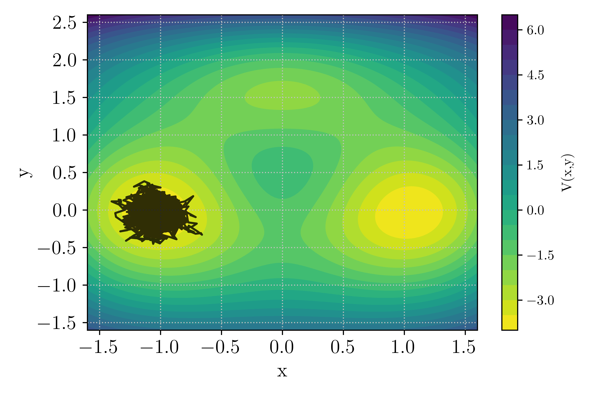

.. highlight:: rst

.. _sec:tutorials:

Tutorials
=========

This set of tutorials is designed to guide the users through the process
of encapsulating their stochastic dynamical system into the framework
of `pyTAMS` in order to smoothly leverage the capabilities of rare
event techniques.

With the exception of a few example cases shipped with the code,
`pyTAMS` will always require the user to formulate her/his problem in
as little as a few dozens of lines of code, to hundreds if the complexity
of the model warrants it.

1D double well
--------------

In this first tutorial, our aim is to implement the 1D double well model
already presented at the end of the :ref:`Theory Section <ssec:theory_1ddw>`. This model
is not already available in `pyTAMS` and will be written from scratch.

Background
~~~~~~~~~~

As a reminder, the 1D double well stochastic dynamical system can be described with
the following stochastic differential equation:

.. math::

   dX_t = f(X_t)\,dt + \sqrt{2\epsilon}\,dW_t.

where :math:`f(X_t) = - \nabla V(X_t)` is derived from a symmetric potential:

.. math::

   V(x) = \frac{1}{4}x^4 - \frac{1}{2}x^2,

:math:`X_t \in \mathbb{R}` is our Markov process, :math:`\epsilon` is the noise scaling parameter and
:math:`dW_t` a 1D Wiener process. We will use a simple Euler-Maruyama method to advance the system
in time.

Getting set up
~~~~~~~~~~~~~~

If you haven't done so yet, let's get the latest version of `pyTAMS` installed on your system.
In your favorite environment manager, simply use:

.. code-block:: shell

   pip install pytams
   tams_check

The second line check that `pyTAMS` is effectively installed and should return (with proper version numbers):

.. code-block:: shell

   == pyTAMS vX.Y.Z :: a rare-event finder tool ==

Now create a new folder for us to work in:

.. code-block:: shell

   mkdir tams_1d_doublewell
   cd tams_1d_doublewell

Writing the forward model
~~~~~~~~~~~~~~~~~~~~~~~~~

Our first task is to implement the SDE provided above in a class that can interact
with `pyTAMS`. As mentioned in the :ref:`Implementation Section <sec:implementation>`,
one needs to wrap all the physics of the stochastic model into an Abstract Base Class (ABC).

To make it easier to start this process from scratch, `pyTAMS` provides a helper function:

.. code-block:: shell

    tams_init_model -n doublewell1D


A local ``doublewell1D.py`` file in created, with a skeleton a your new ``doublewell1D``
class, inheriting from `pyTAMS` required ABC and providing the minimal set of methods (functions)
that are required to run TAMS:

.. code-block:: python

    def _init_model(self, m_id: int, params: dict[typing.Any, typing.Any]) -> None:
    def _advance(self, step: int, time: float, dt: float, noise: Any, need_end_state: bool) -> float:
    def get_current_state(self) -> Any:
    def set_current_state(self, state: Any) -> None:
    def score(self) -> float:
    def make_noise(self) -> Any:

We will now have to properly fill these six functions. Let's start with ``_init_model`` function,
which is called by the superclass initializer and allow to initialize model-specific parameters:

.. code-block:: python

    def _init_model(self, m_id: int, params: dict[typing.Any, typing.Any]) -> None:
        """ ... """
        # Initialize the model state (a single float here)
        # We always start at -1.0
        self._state = -1.0

        # Parse an amplitude factor from the input file
        self._epsilon = params.get("model",{}).get("epsilon",0.02)

        # Let's initialize the Random Number Generator (RNG) to use around
        self._rng = np.random.default_rng()

In this simple model, the model state is a simple float. Note that the state type is
completely up to the user and/or requirements of the model. For instance, if you run an
external program, it might be a path to the program checkpoint file. The above code also
shows how to read-in parameters specified in the input file (see below). Finally, we
initialize a random number generator for subsequent use in the noise generation. This
is not specifically necessary, but it is good practice to control the RNG and we could
pass the model instance ID number ``m_id``, to fix the seed of the RNG and make the runs
reproductible.

Let's look at the getter and setter of the model state:

.. code-block:: python

    def get_current_state(self) -> Any:
        """ ... """
        return self._state

    def set_current_state(self, state: Any) -> None:
        """ ... """
        self._state = state

These two are pretty straightforward for this simple model. Similarly, the ``make_noise``
function writes:

.. code-block:: python

    def make_noise(self) -> Any:
        """ ... """
        return self._rng.standard_normal(1)[0]


Let's now dive into the ``_advance`` function. We will use a Euler-Maruyama scheme to
update the model state, defining the drift function as another method of the class.

.. code-block:: python

    def _drift(self, x: float) -> float:
        """Drift function.

        The drift function f = - nabla(V) = x - x^3 

        Args:
            x: the model state

        Returns:
            The double well potential at the provided state
        """
        return x - x**3

    def _advance(self,
        step: int,
        time: float,
        dt: float,
        noise: Any,
        need_end_state: bool
    ) -> float:
    """ ... """
    self._state = (
        self._state + dt * self._drift(self._state)
        + np.sqrt(2 * dt * self._epsilon) * noise
    )
    return dt

Note that it is important to use the incoming noise ``noise`` and not generate another
noise within the advance function. This is because `pyTAMS` internally keep track of the
noises provided to the advance function, caching them when the model state is sub-sampled for instance.
Additionally, the advance function must return ``dt`` the actual time step size used by the model.
For the current model, this is simply the same as the input parameter ``dt``, but some external
program might have other constraint not allowing the model to run for exactly the provided ``dt``.

Finally, for the score function, we will use the :math:`\xi` function mentioned in the
:ref:`Theory Section <ssec:theory_1ddw>`:

.. math::

    \xi(X_t) = 1.0 - \frac{\Vert X_t - x_{\mathcal{B}}\Vert_2}{\Vert x_{\mathcal{A}} - x_{\mathcal{B}} \Vert_2}

where :math:`\mathcal{B}` is at :math:`X_t = x_b = 1.0` and :math:`\mathcal{A}` is at :math:`X_t = x_a = -1.0`,
with the later being our initial condition. Implementing this in the ``score`` function:

.. code-block:: python

    def score(self) -> float:
        """ ... """
        x_a = -1.0
        x_b = 1.0
        return (1.0 - np.sqrt((self._state - x_b)**2) / np.sqrt((x_a-x_b)**2))

One last thing we need, is to import the `numpy` package since we have used it
in several places. At the top of your file, with the other imports, add:

.. code-block:: python

    import numpy as np

And that is pretty much all you need to have a functioning model class !

Testing the model
~~~~~~~~~~~~~~~~~

Before running TAMS, let's test the model integration within `pyTAMS` framework by running
a single trajectory. In a separate python file (e.g. ``test_dw1D.py``), copy the following:

.. code-block:: python

    from pathlib import Path
    import toml
    import matplotlib.pyplot as plt
    from pytams.trajectory import Trajectory
    from doublewell1D import doublewell1D

    if __name__ == "__main__":
        # For convenience
        fmodel = doublewell1D

        # Load the input file
        with Path("input.toml").open("r") as f:
            input_params = toml.load(f)

        # Initialize a trajectory object
        traj = Trajectory(0, 1.0, fmodel, input_params)

        # Advance the model
        traj.advance()

        # Plain plot the trajectory score history
        plt.plot(traj.get_time_array(), traj.get_score_array())
        plt.grid()
        plt.show()

Note that when running TAMS directly, the user does not have to load the input file
manually. We also need to initialize an input TOML file ``input.toml`` containing the trajectory
and model parameters (see :ref:`Usage Section <sec:usage>` for a complete list
of input keys).

.. code-block:: python

  [trajectory]
  end_time = 10.0
  step_size = 0.01

  [model]
  epsilon = 0.05

We will simulate the random process for 10 time units, with a time step size of 0.01.

Let's now run the script:

.. code-block:: shell

    python test_dw1D.py

Hopefully, this should produce a graph of the same type as the one below (but with
a different trajectory due to randomness).

.. figure:: images/test_doublewell1D.png
   :name: Test_DoubleWell1D
   :align: center
   :width: 70%

   Score history for a single trajectory of the 1D double well model  

Feel free to tweak the input parameters to see if you can trigger a transition ! We are
all set to run TAMS.

Running TAMS
~~~~~~~~~~~~

Similarly to the short script we wrote above to run a single trajectory, let
assemble a small script to run TAMS (e.g. in ``tams_dw1D.py``):

.. code-block:: python

    from pytams.tams import TAMS
    from doublewell1D import doublewell1D

    if __name__ == "__main__":
        # For convenience
        fmodel = doublewell1D

        # Initialize the algorithm object
        tams = TAMS(fmodel_t=fmodel)

        # Run TAMS and report
        probability = tams.compute_probability()
        print(f" TAMS converged with a transition probability: {probability}")

        # Show the envolpe of the ensemble over the course
        # of the algorithm
        tams._tdb.plot_min_max_span("./doublewell1D_minmax.png")

We also need to update the input file with additional parameters relative
to the algorithm parameters:

.. code-block:: python

    [tams]
    ntrajectories = 50
    nsplititer = 500

    [trajectory]
    end_time = 10.0
    step_size = 0.01
    targetscore = 0.95

    [model]
    epsilon = 0.04

    [runner]
    type = "asyncio"
    nworker_init=1
    nworker_iter=1

With above input parameters, the TAMS ensemble will contain 50 members and the algorithm
will proceed up to a total 500 selection/mutation events. The model is assumed to have
transitioned if the score function exceeds :math:`\xi_b = 0.95`. We will run using the
asyncio runner, with a single worker during the initial ensemble generation and the
iterarion process. We have reduced the noise level to :math:`\epsilon = 0.04`.

Let's now run the script:

.. code-block:: shell

    python tams_dw1D.py

The algorithm should run for a few seconds, depending on your platform and how fast the
model transitions. The default log level will report on the algorithm progress during the
entire process, and reports a final summary of the form:

.. code-block:: shell

            ####################################################
            # TAMS v0.0.6             trajectory database      #
            # Date: 2025-11-26 14:58:21.980592+00:00           #
            # Model: doublewell1D                              #
            ####################################################
            # Requested # of traj:                          50 #
            # Requested # of splitting iter:               500 #
            # Number of 'Ended' trajectories:               50 #
            # Number of 'Converged' trajectories:           50 #
            # Current splitting iter counter:              325 #
            # Current total number of steps:            188618 #
            # Transition probability:    0.0013906155192709678 #
            ####################################################

TAMS converged after 325 selection/mutation steps, time at which all 50 trajectories
exceeded :math:`\xi_b` within the 10 time units window. A total of 188618 model steps
were taken and the transition probability estimate is :math:`\hat{P} = 1.39e^{-3}`.

In addition, the script above access the TAMS database to show the history of the
ensemble score functions span (the span of :math:`\mathcal{Q}_{tr}`).

.. figure:: images/minmax_doublewell1D.png
   :name: MinMax_DoubleWell1D
   :align: center
   :width: 70%

   Span of :math:`\mathcal{Q}_{tr}` over the course of the TAMS iterations.

We can this that in this high noise setting, one trajectory rapidly reaches :math:`\mathcal{B}`,
but many more iterations are needed for the entire ensemble to transition.

This is all for this tutorial. We have covered the following points:

- Getting `pyTAMS`
- Going from a pen-and-paper SDE to a practical implementation ready for `pyTAMS`
- Testing the model on a single, isolated trajectory
- Running TAMS

To go further, modify the ``tams_dw1D.py`` script to run TAMS :math:`K` times and
provide a better estimate of the transition probability :math:`\overline{P}_K`, as well as
its relative error. What happens when :math:`\epsilon` is reduced ? Can you trigger saving
the TAMS database to disk ?

Bi-channel problem
------------------

In this tutorial, you will explore transitions in the bi-channel/triple wells, two-dimensional
dynamical system. This system is regularly used for testing rare event algorithm, see for instance
`Brehier et al. <https://www.jstor.org/stable/44249972>`_. In contrast with the 1D double well tutorial,
we will use the implementation already available in `pyTAMS` examples and focus on using the algorithm
to explore the system behavior.

Background
~~~~~~~~~~

The bi-channel/triple well is a 2D overdamped diffusion process in which the potential landscape
features two global minimum (at :math:`(\pm 1.0, 0.0)`) as well as a local minimum near
:math:`(0.0, 1.5)`. The global minima are connected by two channels: the `upper` channel
through the local minima while the `lower` channel goes through the saddle point near :math:`(0.0, -0.4)`.
To take the `upper` channel, a trajectory will need to overcome two energy barriers to enter and exit
the local minima, while the `lower` channel one feature a single barrier albeit of higher depth.

The potential as well as a system trajectory initiated near the left global minima
:math:`\mathcal{A} = (x_A,y_A) = (-1,0)` is presented in Fig. :numref:`fig-Pot_BiChannel`.

.. _fig-Pot_BiChannel:


   : Potential landscape of the bi-channel/triple well 2D case.

The noise level in this model is set by the inverse temperature parameter :math:`\beta`, with low
values of :math:`\beta` corresponding to a high noise level. At low noise levels, the `upper` channel
is more likely as the two smaller energy barriers are easier to cross. In contrast, at high noise levels
the shorter `lower` path becomes more likely as strong noise is able to push the system across the saddle
point.

Getting set up
~~~~~~~~~~~~~~

If you haven't done so yet, let's get `pyTAMS` installed on your system.
In order to have access to the example suite, you will need to install the package from sources.

.. code-block:: shell

   git clone git@github.com:nlesc-eTAOC/pyTAMS.git
   cd pyTAMS
   pip install -e .
   tams_check

The last line check that `pyTAMS` is effectively installed and should return (with proper version numbers):

.. code-block:: shell

   == pyTAMS vX.Y.Z :: a rare-event finder tool ==

Move into the example folder

.. code-block:: shell

   cd pyTAMS/examples/BiChannel2D


The Forward Model
~~~~~~~~~~~~~~~~~

We will not have to modify the forward model in this tutorial, but it is still interesting
to have a look at the content of the ``bichannel2d.py`` file. A quick check of the methods
defined for this model reveals that all the required `@abstractmethod` from the `pyTAMS` ABC are
provided with a concrete implementations (see Tutorial on 1D double well for more details
on this point).

In addition, a ``potential`` and ``drift`` are available to readily access the process
parameters.

.. code-block:: python

    def _init_model(self, m_id: int, params: dict[typing.Any, typing.Any]) -> None:
    def _advance(self, step: int, time: float, dt: float, noise: Any, need_end_state: bool) -> float:
    def potential(cls, x: npt.NDArray[np.number]) -> npt.NDArray[np.number]:
    def drift(cls, x: npt.NDArray[np.number]) -> npt.NDArray[np.number]:
    def get_current_state(self) -> Any:
    def set_current_state(self, state: Any) -> None:
    def score(self) -> float:
    def make_noise(self) -> Any:

The state is a Numpy array with two elements and the noise dimension is also :math:`m=2`.
The model also uses an Euler-Murayama scheme to advance in time and the score function is the
normalized distance to :math:`\mathcal{A}`:


.. math::

    \xi(X_t) = \frac{\Vert X_t - X_A \Vert_2}{\Vert X_B - X_A \Vert_2}


To test that the model is effectively available, you can reproduce Fig. :numref:`fig-Pot_BiChannel`
by running the provided test script:

.. code-block:: shell

    python test_bichannel.py

The script uses the Forward Model ``potential`` function to draw contours of :math:`V(x,y)`.

Running TAMS
~~~~~~~~~~~~

Let's now focus on running TAMS. As mentioned above, this case features two paths for transitioning
from :math:`\mathcal{A} = X_A = (x_A,y_A) = (-1,0)` to :math:`\mathcal{B} = X_B = (x_B,y_B) = (1,0)`. We will start
with running TAMS using :math:`N=32` and up to :math:`J=1000` iteration. The time horizon is
set to :math:`T_a = 20` and the stopping criterion delimiting :math:`\mathcal{B}` is :math:`\xi_b = 1.05`.
All of these parameter can be set in the ``input.toml`` file:


.. code-block:: python

    [tams]
    ntrajectories = 32
    nsplititer = 1000
    loglevel = "WARNING"

    [trajectory]
    end_time = 20.0
    step_size = 0.01
    targetscore = 1.05

    [model]
    inv_temperature = 5.67

    [runner]
    type = "asyncio"
    nworker_init=1
    nworker_iter=1

Note that the log level here was decreased to ``WARNING`` in order to minimize standard output clutering
when running TAMS multiple times. Let's now look at the short script provided for running TAMS with the
bi-channel model ``tams_bichannel.py``:

.. code-block:: python

  import numpy as np           
  from bichannel2d import BiChannel2D
  from bichannel2d import plot_in_landscape
  from pytams.tams import TAMS 
  
  if __name__ == "__main__":   
      # For convenience
      fmodel = BiChannel2D     
    
      # Enable TAMS trajectory plots  
      plot_ensemble = True     

      # Number of consecutive TAMS runs
      K = 10

      # Run the model several times
      for i in range(K):
          # Initialize the algorithm object
          tams = TAMS(fmodel_t=fmodel)

          # Run TAMS and report
          try:
              probability = tams.compute_probability()
          except RuntimeError as e:
              print(e) # noqa: T201
              continue

          print(f"[{i}] : {probability}") # noqa: T201

          if plot_ensemble:
              plot_in_landscape(fmodel, tams.get_database(), i)

      print(f"Averaged transition P_K: {probabilities.mean()}, RE: {np.sqrt(probabilities.var()) / probabilities.mean()}")  # noqa : T201  

As listed above, the script will perform :math:`K = 10` consecutive TAMS runs and report on the averaged
transition probability :math:`P_K` as well as the relative error. In addition, if the ``plot_ensemble`` is activated,
a figure showing the TAMS trajectory ensemble in the potential landscape will be generated for each run.
Let's run the script:

.. code-block:: shell

   python tams_bichannel.py


Depending on the platform you are using, it will take a few minutes to run.

.. note::
   Some of the individual TAMS run might have terminated with:
   ```
   Splitting is stalling with all trajectories stuck at a score_max: 0.7399799334097721
   ```
   This is an occurrence of `extinction`, a known issue of (T)AMS algorithms in which the
   ensemble collapse on a single ancestor trajectory and no significant progress is made
   through iterations until all trajectories have the same :math:`Q_{tr}`. This problem
   is more likely when using small ensemble or using a static score function in TAMS, as
   we do here.


At the value of the inverse temperature
set in the input file :math:`\beta = 5.67`, transition through both channel can occurs with a significant probability
such that out of the 10 runs, you should observe both `upper` and `lower` channel transition as depicted in
the figure below.


.. _fig-TAMS_BiChannel:
.. figure:: images/TAMS_Upper_BiChannel.png
   :name: Upper_BiChannel
   :align: center
   :width: 70%

.. figure:: images/TAMS_Lower_BiChannel.png
   :name: Lower_BiChannel
   :align: center
   :width: 70%

   : Example of TAMS run with transition in the `upper` or `lower` channel

Let's have a look at the behavior of the transition estimator :math:`P_K` as
:math:`K` increases. This is similar to the experiment reported in `Brehier et al. <https://www.jstor.org/stable/44249972>`_,
but we will limit the exercise to :math:`K = 200`. Running such an experiment would
take significant time, beyond the scope of this tutorial. Instead, the probability of 200
TAMS runs are already available in the example folder and can be readily analyzed. Note that
the data were generated using :math:`\beta = 6.67` for which the transition probability is
lower than in the earlier runs we performed here.

The data are stored in a Numpy file ``Pk_beta_6p67_K200.npy``. We will write a small script
to load the data and plot the evolution of :math:`P_K` as :math:`K` goes from 1 to 200.
In a new Python file ((e.g. ``Pk_estimator.py``):

.. code-block:: python

  import contextlib
  import matplotlib.pyplot as plt
  import numpy as np
  
  if __name__ == "__main__":
      # Load the numpy data
      proba = np.load("./Pk_beta_6p67_K200.npy")
  
      # Initialize data containers for P_K
      # and the confidence interval
      pbar = np.zeros(proba.shape[0] - 1)
      pbar[0] = proba[0]
      pbar_ci = np.zeros(proba.shape[0] - 1)
  
      # Compute pbar and pbar_ci
      for k in range(1, proba.shape[0] - 1):
          pbar[k] = proba[:k].mean()
          pbar_ci[k] = 1.0 / np.sqrt(k) * np.sqrt(proba[:k].var())
  
      # Plot the results
      with contextlib.suppress(Exception):
          plt.rcParams.update({"text.usetex": True, "font.family": "serif"})
      plt.figure(figsize=(6, 4))
      plt.xticks(fontsize="x-large")
      plt.yticks(fontsize="x-large")
      plt.xlabel("$K$", fontsize="x-large")
      plt.ylabel("$P_K$", fontsize="x-large")
      plt.plot(np.linspace(1, proba.shape[0] - 1, proba.shape[0] - 1), pbar, color="r")
      plt.fill_between(
          np.linspace(1, proba.shape[0] - 1, proba.shape[0] - 1),
          pbar - pbar_ci,
          pbar + pbar_ci,
          color="r",
          alpha=0.2,
          linewidth=0.0,
      )
      plt.grid(linestyle=":", color="silver")
      plt.tight_layout()
      plt.show()

Running the script above in the bi-channel folder should produce the graph shown in Fig.:numref:`fig-PK_BiChannel`_.
Over the course of 200 runs, the estimator varies significantly and even with :math:`K = 200` the value of :math:`P_K`
continues to change. Of interest is the shaded area, showing the 90% confidence interval, which gives an indication of
the transition probability estimator quality.

.. _fig-PK_BiChannel:
.. figure:: images/TAMS_PK_BiChannel.png
   :name: PK_BiChannel
   :align: center
   :width: 70%

   : Evolution of :math:`P_K` with :math:`K` repetitions of the TAMS algorithm.

Accessing the TAMS database
~~~~~~~~~~~~~~~~~~~~~~~~~~~

So far, we have performed multiple runs of TAMS but have had limited access to the welth of data
generated during the course of the algorithm. Looking back into the previous section, we have
used TAMS data to visualize the trajectory ensemble on the potential landscape.
The TAMS database object can be accessed during or after a TAMS run using:

.. code-block:: python

    tdb = tams.get_database()

where ``tams`` is an instance of the TAMS object. In the example script used above, the database
object is send to the function constructing the plot: the ``plot_in_landscape`` function
in ``bichannel2d.py``. The few lines of code used to access the data in the database are reported
below:


.. code-block:: python

   for t in tdb.traj_list():
       state_x = np.array([s[1][0] for s in t.get_state_list()]) 
       state_y = np.array([s[1][1] for s in t.get_state_list()])

Here we loop on the list of `active` trajectories ``tdb.traj_list()``, i.e. the ensemble
of :math:`N` trajectories active at the current iteration of the algorithm. We then used Python
list comprehension to go through the trajectory and extract a Numpy array of the system state
components :math:`x` and :math:`y`.

In our previous TAMS runs, we could no longer access the database after exiting the script
since the data was not saved to disk. Let's now run one more time the algorithm, allowing to
create a database on disk. To do so, let's add the appropriate keyword to the input file
``input.toml``:


.. code-block:: python

   [database]
   path = "./db_tams_bichannel.tdb"


,update the ``tams_bichannel.py`` script to only run once by changing the value of :math:`K`:


.. code-block:: python

   # Number of consecutive TAMS runs
   K = 1
    
and run the script again:

.. code-block:: shell

   python tams_bichannel.py

Note that saving the database to disk incurs an overhead, which is not negligeable for
such a small model. Looking into your run folder should now show that a TAMS database
was saved:

.. code-block:: shell

  ls -d db*
  db_tams_bichannel.tdb

Let's now put together a small script to load the database and access some of its data.
In a new Python file (e.g. ``load_database.py``):

.. code-block:: python

  from pytams.database import Database
  from pathlib import Path


  if __name__ == "__main__":   
      # Load the database from disk
      tdb = Database.load(Path("./db_tams_bichannel.tdb"))
      tdb.load_data(load_archived_trajectories=True)

      # Show the ensemble scores at the last iteration
      tdb.plot_score_functions("./ScoreEnsemble.png")

      # Show the evolution of the ensemble span over
      # the course of TAMS iterations
      tdb.plot_min_max_span("./ScoreMinMax.png")

      # Go through the active trajectories
      # and display the max score
      for t in tdb.traj_list():
          print(f"Trajectory {t.id()} final max score: {t.score_max()}")

      # Get the active trajectory list at initial iteration
      # and display the max score
      for t in tdb.get_trajectory_active_at_k(0):
          print(f"Trajectory {t.id()} initial max score: {t.score_max()}")

The first line above instantiate the ``Database`` object, but only load metadata from disk. Only data such
as the number of trajectories, the current index of the TAMS iteration and some trajectories metadata
(did it converged, what is the maximum of the score function, ...) are available.
The ``load_data`` function effectively load the entire content of the trajectories in memory. By default
only the `active` trajectory data are loaded, i.e. the trajectory at the end of the TAMS algorithm. By
activating the ``load_archived_trajectories`` flag, we trigger loading the full list of trajectories
including the ones discarded during the TAMS iterations.
A couple of helper functions allow to asses the state of the ensemble by plotting the score functions
as well as the evolution of the ensemble over the course of the iterations.


This is all for this tutorial. We have covered the following points:

- Exploring one of `pyTAMS` built-in example
- Running TAMS multiple times in order to get a better transition probability estimator and uncertainty
- Accessing, saving and loading the TAMS database

To go further, modify the change the value of the inverse temperature :math:`\beta` parameter
and see how that affect the probability of transitioning through the `upper` and `lower` channels,
look at the ``Database`` and ``Trajectory`` APIs (`database API <./autoapi/pytams/database/index.html>`_)
to extract more data from the database and get the most out of your TAMS runs !

2D Boussinesq model
-------------------

So far, the tutorials have been focused on fairly simple models for which `pyTAMS` is practical,
but also incurs a computational overhead that might not be justified compared to more simple
implementation of the algorithm.

We will now turn our attention to a more complex model, with :math:`10^4` degrees-of-freedom
for which `pyTAMS` is specifically designed for. The model is a stochastic partial
differential equation (SPDE) described in `Soons et al. <https://doi.org/10.1017/jfm.2025.248>`_.
Two versions of this model are available in `pyTAMS` examples and the present tutorial will
focus on the C++ implementation ``examples/BoussinesqCpp`` in order to demonstrate how
to couple `pyTAMS` with an external software (as might be the case for many user of existing
physics models). The interested reader can dig into the ``examples/Boussinesq`` to study the
implementation of a Python-only version.

One final note to motivate the use of `pyTAMS`: a :math:`10^4` state requires about 80 kB
of memory and considering a model trajectory consists of 4000 individual states, an `active` set of
:math:`N=20` trajectories requires about 6 GB of memory. This turns out to be only a fraction
of the full memory requirements of TAMS as the total number of trajectories increases with
the number of iterations, making it impossible to run TAMS on such a model without
partially storing data to disk and sub-sampling the states (both native features of `pyTAMS`).

Getting set up
~~~~~~~~~~~~~~

If you haven't done so yet, let's get `pyTAMS` installed on your system.
In order to have access to the example suite, you will need to install the package from sources.

.. code-block:: shell

   git clone git@github.com:nlesc-eTAOC/pyTAMS.git
   cd pyTAMS
   pip install -e .
   tams_check

The last line check that `pyTAMS` is effectively installed and should return (with proper version numbers):

.. code-block:: shell

   == pyTAMS vX.Y.Z :: a rare-event finder tool ==

Move into the example folder

.. code-block:: shell

   cd pyTAMS/examples/BoussinesqCpp


BoussinesqCpp Folder content
~~~~~~~~~~~~~~~~~~~~~~~~~~~~

Before diving into the code, let's first have a look at the content of the folder
as many more files are involved compared to previous tutorials:

.. code-block:: shell

     Boussinesq.cpp             # Implementation of physics model in C++
     Boussinesq.h               # C++ model headers
     Makefile                   # GNUmake file
     Messaging.h                # Messaging library header, C++ side
     OFFState.bin               # Model OFF state data, in binary format
     OFFState.xmf               # Model OFF state data visualization (use Paraview)
     ONState.bin                # Model ON state data, in binary format
     ONState.xmf                # Model ON state data visualization (use Paraview)
     README.md
     __init__.py
     boussinesq2d.py            # The forward model implementation
     eigen_lapack_interf.h      # Eigen to LAPACK interface C++ header
     input.toml                 # TAMS input file
     messaging.py               # Messaging library, Python side
     tams_boussinesq2d.py       # Script for running TAMS

There are three main components to this model:

- The model physics is encapsulated in a C++ program (``Boussinesq.h``, ``Boussinesq.cpp``, ``eigen_lapack_interf.h``)
- An inter-process communication (IPC) module with a C++ (``Messaging.h``) and a Python (``messaging.py``) side
- The `pyTAMS` ABC concrete implementation for this model (``boussinesq2d.py``)

When coupling an external model to `pyTAMS`, one should consider the possibility of
maintaining the physics program continuously running in the background to avoid having to start and
terminate the program repeatedly. In the present case, we implemented a simple IPC that enables running the C++
in the background all the time while controlling its flow from Python as `pyTAMS` proceeds. This might not
always be possible if you do not have access to the physics program source code.

Our aim here is not to dive too much into the C++ side, as the physics implementation is not
particularly transferable to other cases, but to explore how to set up the ABC forward model
implementation for an external program.

Let's kick off this tutorial by compiling the physics program.
Follow the instructions of the ``README.md`` file to obtain the external dependencies for this
case (Eigen and LAPACK) and make sure you are able to compile the C++ program:

.. code-block:: shell

   make
   ls boussinesq.exe

BoussinesqCpp forward model
~~~~~~~~~~~~~~~~~~~~~~~~~~~

Let's first look at the ``_init_model`` function in ``boussinesq2d.py`` to get a clear view of the
model attributes:

.. code-block:: python

  self._m_id = m_id                               # The unique id of the model instance
  self._M = subparms.get("size_M", 40)            # Number of grid point in latitude
  self._N = subparms.get("size_N", 80)            # Number of grid point in depth
  self._K = subparms.get("K", 7)                  # Number of Fourier modes for the stochastic forcing
  self._eps = subparms.get("epsilon", 0.05)       # Variance of the Wiener noise process
  self._exec = subparms.get("exec", None)         # The executable of the external physics program
  self._exec_cmd = [                              # The command to start the external physics program
      self._exec,
      "-M",
      str(self._M),
      "-N",
      str(self._N),
      "-K",
      str(self._K),
      "--eps",
      str(self._eps),
      "--pipe_id",
      str(m_id),
  ]
  self._proc = None                               # The id of the process of the external program
  self._pipe = None                               # The IPC (named here pipe as it uses two-way pipes)
  self._state = subparms.get("init_state", None)  # The model state

The model physical parameters are read from the input file (``size_M``, ``size_N``, ``K``, ``epsilon``) and used
to start the external program along with a path to its executable. The C++ program does not start at this point,
but will be launched upon calling the advance function for the first time.
In this model, the state is not directly the model state as an array of data but rather a path to
a file on disk, generated/read by the external model. This has direct implication for the setter and getter
function of the ABC: the ``set_current_state`` function must not only set the ``self._state`` variable on the
Python side, but also communicate that information with the C++ program:

.. code-block:: python

  def set_current_state(self, state: Any) -> None:
      """Set the model state.

      And transfer it to the C++ process if opened

      Args:
          state: the new state
      """
      self._state = state
      if not self._proc:
          return

      self._pipe.post_message(Message(MessageType.SETSTATE, data=state.encode("utf-8")))

      ret = self._pipe.get_message()
      if ret.mtype != MessageType.DONE:
          err_msg = "Unable to set the state of the C++ code"
          _logger.error(err_msg)
          raise RuntimeError

If we now take a closer look at the advance function, there are a few notable things to notice:


.. code-block:: python

    def _advance(self, _step: int, _time: float, dt: float, noise: Any, need_end_state: bool) -> float:
        """Advance the model.

        Args:
            step: the current step counter
            time: the starting time of the advance call
            dt: the time step size over which to advance
            noise: the noise to be used in the model step
            need_end_state: whether the step end state is needed

        Return:
            Some model will not do exactly dt (e.g. sub-stepping) return the actual dt
        """
        if not self._proc:
            # Initialize the C++ process and the twoway pipe
            self._proc = subprocess.Popen(self._exec_cmd)

            self._pipe = TwoWayPipe(str(self._m_id))
            self._pipe.open()

            # Send the workdir
            self._pipe.post_message(Message(MessageType.SETWORKDIR, data=self._workdir.as_posix().encode("utf-8")))

            # Set the initial state
            self.set_current_state(self._state)

        if need_end_state:
            self._pipe.post_message(trigger_save_msg)

        self._pipe.post_message(Message(MessageType.ONESTOCHSTEP, data=noise.tobytes()))
        ret = self._pipe.get_message()
        if ret.mtype != MessageType.DONE:
            err_msg = "Unable to access the score from the C++ code"
            _logger.error(err_msg)
            raise RuntimeError

        self._score = struct.unpack("d", ret.data)[0]

        if need_end_state:
            self._state = self.get_last_statefile()
        else:
            self._state = None

        return dt

- Upon the first call to the advance function, the C++ program is started using Python `subprocess`. At
  the same time, the IPC two-way pipe is initialized and the initial condition communicated to the 
  external program.
- `pyTAMS`'s trajectory API allows to downsample the state stored in the trajectory and the advance function
  ``need_end_state`` argument is set to ``True`` when the algorithm expects a state. This is also transferred
  to the C++ program before effectively advancing the model. Depending on how your model handles IO, you can use
  this parameter to make sure a checkpoint file is generated (or possibly suppress a checkpoint file if your
  model always produces IO but it is not needed)

The noise increment for the model's stochastic forcing is still generated on the Python side and
communicated to the external C++ program when performing a model time step. Additionally, the Python
ABC does not have access to the C++ program state variables (i.e. the physical field of temperature, salinity, ...)
and must query the model to get the score function (transferring entire variable fields to Python would
slow the model significantly).

One last function worth noting is ``_clear_model``:

.. code-block:: python

    def _clear_model(self) -> None:
        if self._proc:
            self._pipe.post_message(exit_msg)
            self._proc.wait()
            self._proc = None
            self._pipe.close()
            self._pipe = None

This function is part of `pyTAMS` forward model ABC but does not *need* to be overwritten by a concrete
implementation. It is always called upon completing a trajectory (i.e. reaching the score function target
value or the final time horizon) and in the current model, it terminates the external C++ program.

Running TAMS locally
~~~~~~~~~~~~~~~~~~~~

We will now run TAMS with the Boussinesq model. This model is significantly more computationally
expensive that the other models used in previous tutorial, but it still only takes a few dozens
minutes to perform a TAMS run on a laptop.

Let's review the content of the input file ``input.toml``:

.. code-block:: python

    [tams]
    ntrajectories = 20
    nsplititer = 200
    loglevel = "INFO"
    diagnostics = true


The number of ensemble member is set to :math:`N=20` and the maximum of iteration set to :math:`J = 200`.
We enable diagnostic to ``True`` is order to visualize the evolution of the ensemble during the course
of the iterations, as depicted in the last graph of the :ref:`Theory Section <sec:theory>`.

.. code-block:: python

    [trajectory]
    end_time = 20.0
    step_size = 0.005
    targetscore = 0.95
    sparse_freq = 10

The time horizon is set to :math:`T_a = 20` time units and the step size 0.005. The target score function
defining the model AMOC collapsed state is :math:`\xi_b = 0.95`. Finally, only one state every 10 steps will
be requested (i.e. the advance function argument ``need_end_state`` will be ``False`` 9 out of 10 calls. This
reduce by an order of magnitude the disk space requirements. Note that this parameter is a disk space versus
compute trade-off, as sparser trajectory will require to recompute some model steps during the cloning/branching
step of the algorithm.

.. code-block:: python

    [model]
    exec = "./boussinesq.exe"
    init_state = "./ONState.bin"
    size_M = 40
    size_N = 80
    epsilon = 0.05
    K = 7

The model parameters are parsed in the model ``_init_model`` function and control the size of computational
model as well as stochastic forcing shape and intensity. The initial condition is set to be the AMOC `ON` state.
Note that the noise level here is fairly high :math:`\epsilon = 0.05`, such that the transition is not so rare
in order to limit the compute time.

.. code-block:: python

    [runner]
    type = "dask"
    nworker_init=2
    nworker_iter=2

When running the model locally, both `asyncio` and `dask` runner are valid options. Here we use Dask by default,
spawning two workers during the initial ensemble generation and two workers during the TAMS iterations. The
later parameter effectively means that at least the two trajectories with the lowest value of the maximum score
function will be discarded and new trajectory cloned/branched at each TAMS iterations.

.. code-block:: python

    [database]
    path = "2DBoussinesqCpp.tdb"

Running this model always requires creating a database on disk to store the external model data.

As with previous Tutorials, there a short script in the example folder to launch TAMS:

.. code-block:: shell

    python tams_boussinesq2d.py

For the sake of keeping this tutorial short, only a single TAMS run is required.

The standard output should look something like:

.. code-block:: shell

    [INFO] 2025-12-04 22:46:02,769 -
                ####################################################
                # TAMS v0.0.6             trajectory database      #
                # Date: 2025-12-04 21:46:02.752567+00:00           #
                # Model: 2DBoussinesqModelCpp                      #
                ####################################################
                # Requested # of traj:                          20 #
                # Requested # of splitting iter:               500 #
                # Number of 'Ended' trajectories:                0 #
                # Number of 'Converged' trajectories:            0 #
                # Current splitting iter counter:                0 #
                # Current total number of steps:                 0 #
                # Transition probability:                      0.0 #
                ####################################################

    [INFO] 2025-12-04 22:46:02,785 - Computing 2DBoussinesqModelCpp rare event probability using TAMS
    [INFO] 2025-12-04 22:46:02,785 - Creating the initial ensemble of 20 trajectories
    [INFO] 2025-12-04 22:46:03,292 - Advancing traj000002_0000 [time left: 86399.487147]
    [INFO] 2025-12-04 22:46:03,293 - Advancing traj000003_0000 [time left: 86399.486938]
    [INFO] 2025-12-04 22:46:28,092 - Advancing traj000018_0000 [time left: 86374.679952]
    [INFO] 2025-12-04 22:46:28,120 - Advancing traj000006_0000 [time left: 86374.651914]
    ...
    [INFO] 2025-12-04 22:50:49,663 - Advancing traj000010_0000 [time left: 86113.108818]
    [INFO] 2025-12-04 22:51:14,384 - Advancing traj000012_0000 [time left: 86088.387617]
    [INFO] 2025-12-04 22:51:14,437 - Advancing traj000000_0000 [time left: 86088.334118]
    [INFO] 2025-12-04 22:51:39,418 - Run time: 336.648924 s
    [INFO] 2025-12-04 22:51:39,418 - Using multi-level splitting to get the probability
    [INFO] 2025-12-04 22:51:39,992 - Starting TAMS iter. 0 with 2 workers
    [INFO] 2025-12-04 22:51:40,595 - Restarting [19] from traj000003_0000 [time left: 86062.184477]
    [INFO] 2025-12-04 22:51:40,597 - Restarting [4] from traj000001_0000 [time left: 86062.183612]
    [INFO] 2025-12-04 22:52:02,934 - Starting TAMS iter. 2 with 2 workers
    [INFO] 2025-12-04 22:52:03,365 - Restarting [10] from traj000019_0001 [time left: 86039.406361]
    [INFO] 2025-12-04 22:52:03,383 - Restarting [2] from traj000017_0000 [time left: 86039.388611]
    [INFO] 2025-12-04 22:52:23,398 - Starting TAMS iter. 4 with 2 workers
    ...
    [INFO] 2025-12-04 22:59:55,533 - Starting TAMS iter. 102 with 2 workers
    [INFO] 2025-12-04 22:59:55,848 - Restarting [8] from traj000016_0008 [time left: 85566.924079]
    [INFO] 2025-12-04 22:59:55,879 - Restarting [7] from traj000000_0003 [time left: 85566.892251]
    [INFO] 2025-12-04 22:59:57,955 - Starting TAMS iter. 104 with 2 workers
    [INFO] 2025-12-04 22:59:58,134 - All trajectories converged after 104 splitting iterations
    [INFO] 2025-12-04 22:59:58,317 - Run time: 835.547348 s
    [INFO] 2025-12-04 23:00:02,499 - 104 archived trajectories loaded
    [INFO] 2025-12-04 23:00:02,521 -
                ####################################################
                # TAMS v0.0.6             trajectory database      #
                # Date: 2025-12-04 21:46:02.752567+00:00           #
                # Model: 2DBoussinesqModelCpp                      #
                ####################################################
                # Requested # of traj:                          20 #
                # Requested # of splitting iter:               500 #
                # Number of 'Ended' trajectories:               20 #
                # Number of 'Converged' trajectories:           20 #
                # Current splitting iter counter:              106 #
                # Current total number of steps:            183619 #
                # Transition probability:    0.0037570973859534823 #
                ####################################################


Since ``diagnostic`` is set to ``True``, a series of images ``Score_k0****.png`` showing the
ensemble at each iterations (every two cloning/branching events) is generated.

Running TAMS on a Slurm cluster
~~~~~~~~~~~~~~~~~~~~~~~~~~~~~~~

In the event you have access to an HPC cluster, we will now update the input file to run
TAMS on a Slurm cluster.

.. code-block:: python

    [tams]
    walltime = 7100

    [dask]
    backend = "slurm"
    worker_walltime = "2:00:00"
    queue = "genoa"
    ntasks_per_job = 1
    job_prologue = ['module load Python', 'conda activate pyTAMS']

The default backend of the ``dask`` runner is ``local``, by setting it to ``slurm`` Dask will
submit the workers as Slurm jobs. The job wall time will be set to 2 hours and be submitted to
the ``genoa`` partition. The algorithm walltime must thus be updated to not exceed the job wall time.
The strings listed in the ``job_prologue`` will be executed before starting the worker and can be
used to setup your environment.

If your cluster allows it, can launch the TAMS script from the login node (very to no compute is done by the main
process in TAMS), otherwise you will have to launch the TAMS script from a Slurm batch script.

This is all for this tutorial. We have covered the following points:

- Interfacing an external program with `pyTAMS`
- Triggering diagnostics while running TAMS
- Using multiple workers and running TAMS on a Slurm cluster

To go further, interested users can change the model noise parameters or repeat the experiment
multiple times. Additionally, the Python version of the Boussinesq model has several custom
features and comparing the two implementations could be a good source of information for developing
your own model.
