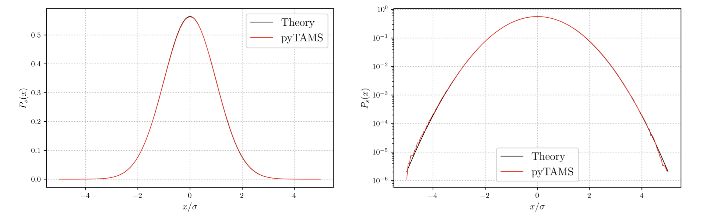

.. highlight:: rst

.. _sec:validation:

.. _BaarsThesis: https://research.rug.nl/en/publications/numerical-methods-for-studying-transition-probabilities-in-stocha/
.. _LestangTAMS: https://doi.org/10.1088/1742-5468/aab856
.. _LestangThesis: https://theses.hal.science/tel-01974316v1/file/LESTANG_Thibault_2018LYSEN049_These.pdf

Validation
==========

Even if the core of the `pyTAMS` algorithm is not particularly complex, details of
the implementation can lead to systematic biases on the rare event probability
estimator, especially when the event :math:`\mathcal{E}` probability becomes
`very` rare (:math:`P(\mathcal{E}) < 1e^{-6}`).

In this section we validate `pyTAMS` implementation on a couple of simple,
low dimensional cases and since the algorithm is decoupled from the physics
of the model, the validity extends to more complex physics model for which
no theoretical data is available.

1D Ornstein-Ulhenbeck process
-----------------------------

The simple case of a one dimensional Ornstein-Ulhenbeck (OU) process is part of
`pyTAMS` examples suite. It is an interesting case to consider since
`Lestang et al. <LestangTAMS>`_ used this model while developing the TAMS
algorithm. In contrast with the :ref:`Theory Section <sec:Theory>`, the OU
process do not feature multistability, but we are interested in predicting
the occurrence of extreme values of the process.

Before jumping into TAMS results, we can provide an estimate of the process
stationary distribution :math:`P_s(x)` using a very long trajectory (:math:`10^{8} steps`).
The OU process parameters are set to :math:`\theta = 1.0` and :math:`epsilon = 0.5`, for which
theoretical :math:`P_s(x) = \mathcal{N}(0,\sigma)` with :math:`\sigma = \sqrt{\epsilon/\theta}`.
The log-scale plot of the distribution shows that extreme values of the process
(:math:`abs(x) > 4\sigma`) are poorly sampled using such a Monte Carlo approach.

.. _fig-Distrib_OU1D:

   :Stationary distribution :math:`P_s(x)` of the OU process obtained with TAMS

We will now use TAMS to predict the return time :math:`r(a)` of the value $a$ in the OU process.
This is specifically what TAMS was developed for. The results of TAMS are obtained from 25
independent TAMS runs, with :math:`N = 100`, :math:`T_a = 5 \tau_c` and :math:`\xi_{max} = 8\sigma`.
The long trajectory used in producing :numref:`fig-Distrib_OU1D` is processed using the block-maximum
method to provide an estimate of :math:`\hat{r}(a)`
and the theoretical :math:`r(a)` in also given by equation A6 of `Lestang et al. <LestangTAMS>`_.
The graph :numref:`fig-ReturnTime_OU1D` shows the return time in abscissa and the value of :math:`a` in ordonate for all
three methods. The agreements between `pyTAMS` and the theoretical value of the return time demonstrate
that the current implementation is able to correctly estimate rare events, down to very probability
(:math:`P(\mathcal{E}) < 10^{-10}`)

.. _fig-ReturnTime_OU1D:
.. figure:: images/returntimes_OU.png
   :name: ReturnTime_OU1D
   :align: center
   :width: 70%

   : Comparison of return times :math:`\hat{r}(a)` of an OU process obtained
   with the block-maximum method, TAMS and the theoretical expression of Lestang et al.

2D double well case
-------------------

The case of the 2 dimensional double well (readily available in `pyTAMS` examples)
has been extensively studied by `Baars <BaarsThesis>`_
and we will use Baars data as reference for `pyTAMS` results.

Specifically, let's look at the transition probability from one well to the other
within a time horizon :math:`T_a` decreasing from 10 to 2 time units. We will run
TAMS with a small ensemble :math:`N = 50`, iterating until all the ensemble members
reach :math:`\mathcal{B}`, the well located at :math:`X_t = x_B = (1.0, 0.0)`.
At each value of :math:`T_a`, we run :math:`K = 100` independent runs of TAMS to
compute the transition probability estimate:

.. math::
   \overline{P}_K = \frac{1}{K}\sum_{k=1}^K \hat{P}_k

where :math:`\hat{P}_k` is the transition probability of a single TAMS run. Note that
`Baars <BaarsThesis>`_ used :math:`N=10000` and :math:`K = 1000` which provides a more accurate
estimator. Following `Baars <BaarsThesis>`_, we also use the 25-75 interquartile range (IQR)
to give an indication of the estimator quality (standard confidence interval are not
appropriate for near-zero distributions).

:numref:`fig-Valid_DoubleWell2D` shows `pyTAMS` :math:`\overline{P}_K` in the range of values of
:math:`T_a` considered, along with the IQR given by the shaded area and results
from `Baars <BaarsThesis>`_.

.. _fig-Valid_DoubleWell2D:
.. figure:: images/valid_doublewell2D.png
   :name: Valid_DoubleWell2D
   :align: center
   :width: 70%

   : Transition probability estimate :math:`\overline{P}_K` at several
   values of :math:`T_a` in the 2D double well case

The agreement between the two datasets is good, even though the accuracy of the `pyTAMS`
results are expected to be lower due to the relatively small :math:`N` and :math:`K` used
compared to `Baars <BaarsThesis>`_. As :math:`T_a` decreases, the IQR become less symmetric
around :math:`\overline{P}_K`, mostly due to the choice of a `static` score function which
causes TAMS to stall if the transition is initiated too close to :math:`T_a`.

